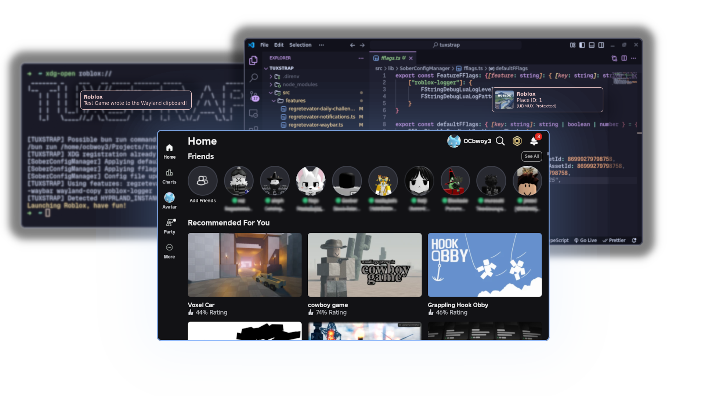

 

 TuxStrap
  
 Roblox Wrapper for Linux

> [!NOTE]
> **TuxStrap is NOT a Roblox runtime.** For that, you'll need [Sober](https://sober.vinegarhq.org).

This is a wrapper for Roblox written in TypeScript, which acts as an alternative to BloxstrapRPC (and features that use it) for Linux. As an extra, you can write your own integrations and add them directly into TuxStrap's source code, and probably even more!

Installation and Usage

## Installation

To install TuxStrap, you'll need.

- [Sober](https://sober.vinegarhq.org)
- Bun
- libnotify

Firstly, clone this repository into a folder of your choice and then run `bun install`. Then, run `bun run dev` to start Roblox and (hopefully) create all XDG registrations to `roblox://` and desktop entrties.

I'd recommend using Hyprland, as this program uses `hyprctl` to create the process in the background. Otherwise, you could do it with your WM/DE's preferred way, or fork the process and disown it.

When you're updating Roblox, make sure to run Sober (and not TuxStrap) via the `flatpak run` command instead!

As an additional note, you can run `bun run src/index.ts --help` for help options.

## Usage

Upon installing TuxStrap, you'll need register Roblox's URL protocol with `xdg-mime`. The best way to do it is to launch it with `bun run src/index.ts`.

Once done, run `xdg-open roblox://tuxstrap` in the terminal to open up the account switcher. If you don't have a profile, create it and switch to it.

Notice

TuxStrap is a hobby project and is **not affiliated** with Roblox, Roblox Corp. or VinegarHQ in any way.

All trademarks and registered trademarks are the property of their respective owners.

</notice>

